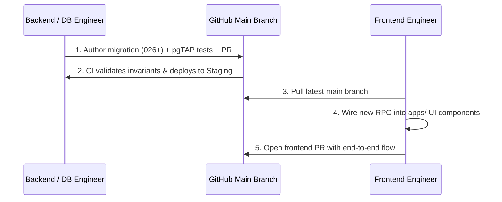

# Team Onboarding & Developer Guide

Welcome to the **Box Codex** project! This repository contains the unified monorepo for the turf and venue management platform, covering the Player application, Venue Owner portal, Admin dashboard, and backend database invariants.

> [!IMPORTANT]
> - **Repository URL:** [https://github.com/Dhruv6576/Ewrone](https://github.com/Dhruv6576/Ewrone)
> - **Visibility:** **PUBLIC**
> - **Runtime Engine:** **Node.js 22 LTS** (`>=22`)
> - **Dependency Installation:** Always use `npm ci` at repository root.

---

## 1. Quick Start Paths

### Path A: Local Development Backend & Fixtures
Use this path for daily development, running unit/integration test suites, or building frontend components.

```bash
# 1. Install dependencies
npm ci

# 2. Start local Supabase containers (Docker required)
npx supabase start

# 3. Seed local baseline fixtures (venues, resources, and demo users)
node scripts/seed_local.mjs

# 4. Sync worker and environment configurations for local testing
node scripts/set_worker_config.mjs --target=local

# 5. Launch frontend dev servers
npm --prefix apps/player run dev   # Player portal (http://localhost:3000)
npm --prefix apps/owner run dev    # Owner portal  (http://localhost:3001)
npm --prefix apps/admin run dev    # Admin portal  (http://localhost:3002)
```

### Path B: Hosted Staging Verification
To verify changes against the hosted staging Supabase environment (`akbndqzrnqxyckldboaw`):

```bash
# Bootstrap staging verification (requires staging credentials in supabase/.env.hosted)
node scripts/bootstrap.mjs --target=staging
```

---

## 2. Standard Team Workflow

Because the repository is public and protected by branch rules, all team members must follow this workflow:

1. **Pull Before Working:** Always run `git pull origin main` to ensure your base is up to date.
2. **Feature Branching:** Create a dedicated branch for your work:
   ```bash
   git checkout -b feat/your-feature-name
   ```
3. **Open Pull Requests:** Push your feature branch to GitHub and open a Pull Request into `main`. Direct pushes to `main` are prohibited and blocked by GitHub branch protection rules.
4. **Pass Automated Status Checks:** Every PR must pass the two mandatory CI jobs:
   - `Code Quality & Invariant Guards`
   - `Supabase pgTAP & Automated Test Suites`
5. **Never Commit Secrets or Environment Files:**
   - Only `.env.example` and `.env.staging.example` files are tracked.
   - All `.env`, `*.local`, and secret files are strictly ignored by `.gitignore`.
   - Secret scanning and push protection are active on the repository and will reject any push containing recognized credential patterns.

---

## 3. The Three Hard Rules

1. **Node.js 22 Required:** All tools, CI workflows, and local environments must use Node.js 22 LTS (`>=22`). Node.js 20 lacks native WebSocket support required by `@supabase/realtime-js` and is deprecated.
2. **Migrations 001–025 are FROZEN:**
   - Migrations `20260918000001` through `20260918000025` represent immutable baseline schema.
   - Any new database modifications **must** begin at `20260918000026` or higher.
   - Modifying existing migration files will trigger an immediate CI quality gate failure.
3. **Never Expose Private Keys to Client Apps:**
   - The Supabase `service_role` key, database passwords, and `RAZORPAY_KEY_SECRET` must **never** be imported into or bundled with client apps (`apps/player`, `apps/owner`, `apps/admin`).
   - Only `NEXT_PUBLIC_SUPABASE_ANON_KEY` and public Razorpay Key IDs (`rzp_test_*` or `rzp_live_*`) may be exposed to frontends.

---

## 4. Demo Accounts Table (LOCAL ONLY)

When using `node scripts/seed_local.mjs`, the following local test accounts are provisioned. 

> [!WARNING]
> These demo accounts and passwords exist **strictly on local development databases**. They do not exist on staging or production.

| Role | Email | Password | Intended Portal |
| :--- | :--- | :--- | :--- |
| **Master Venue Owner** | `demo_owner@boxcodex.internal` | `Password123!` | [apps/owner](file:///C:/Dhruv/Projectss/Box%20Codex/apps/owner) (`http://localhost:3001`) |
| **Staff Employee** | `demo_staff@boxcodex.internal` | `Password123!` | [apps/owner](file:///C:/Dhruv/Projectss/Box%20Codex/apps/owner) (`http://localhost:3001`) |
| **Platform Admin** | `demo_admin@boxcodex.internal` | `Password123!` | [apps/admin](file:///C:/Dhruv/Projectss/Box%20Codex/apps/admin) (`http://localhost:3002`) |
| **Live Player** | `live_player@example.com` | `Password123!` | [apps/player](file:///C:/Dhruv/Projectss/Box%20Codex/apps/player) (`http://localhost:3000`) |

---

## 5. What is NOT Ready Yet

The following items are pending final deployment infrastructure and must not be assumed complete:
- **No Deployed Frontend Origin:** Web frontends are not yet deployed to Vercel/Cloudflare; there are no production URLs.
- **Staging Auth Site URL:** The staging Supabase Auth `site_url` configuration is currently pointed to `http://localhost:3000`. Redirects to deployed frontend origins will be configured once domains are established.
- **Production Environment Unprovisioned:** The `production` environment is intentionally unprovisioned (`SUPABASE_PROD_PROJECT_REF` is unset). The deployment pipeline safely skips production until explicit infrastructure provisioning is approved.

---

## 6. Collaborator Onboarding

Collaborator access to the GitHub repository is managed by the repository owner:
- **Invite Path:** [Settings -> Collaborators](https://github.com/Dhruv6576/Ewrone/settings/access)
- **Procedure:** All collaborators must be explicitly invited by username by the repository owner (`Dhruv6576`).

---

## 7. Backend -> Frontend Handoff Workflow

To keep database invariants and frontend UI cleanly in sync:



1. **Backend First:** Database migrations, RLS policies, and RPC functions land on `main` and deploy to staging first.
2. **Frontend Wiring:** Frontend engineers pull `main` and wire the new `.rpc('...')` calls into the relevant `page.tsx` routes.
3. **Continuous Integration:** CI runs the full suite of end-to-end tests to verify that UI expectations and database constraints remain 100% aligned.
