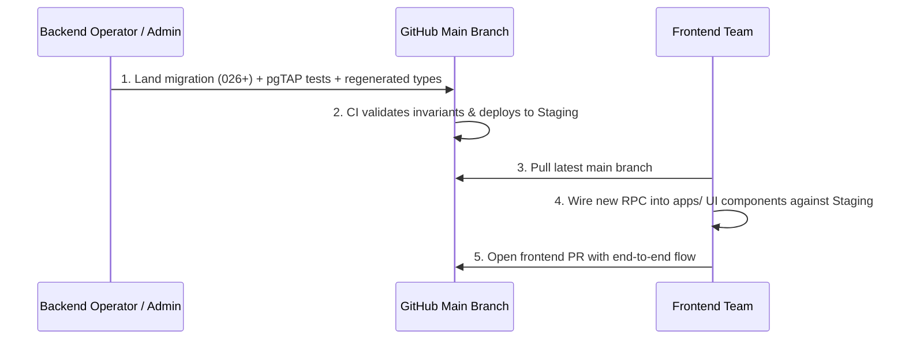

# Team Onboarding & Developer Guide

Welcome to the **Box Codex** project! This repository contains the unified monorepo for the turf and venue management platform, covering the Player application, Venue Owner portal, Admin dashboard, and backend database invariants.

> [!IMPORTANT]
> - **Repository URL:** [https://github.com/Dhruv6576/Ewrone](https://github.com/Dhruv6576/Ewrone)
> - **Visibility:** **PUBLIC**
> - **Runtime Engine:** **Node.js 22 LTS** (`>=22`)
> - **Dependency Installation:** Always use `npm ci` at repository root.

---

## 1. Quick Start Paths

### Path A (DEFAULT): Hosted Staging Backend (Docker-Free)

Frontend engineers **do not need Docker or local Supabase**. Work directly against the hosted staging backend:

1. **Accept GitHub Invitation**:
   Accept your repository invitation at [https://github.com/Dhruv6576/Ewrone/invitations](https://github.com/Dhruv6576/Ewrone/invitations) or via the email notification. Push access to create feature branches requires accepted collaborator status.
2. **Clone the repository**:
   ```bash
   git clone https://github.com/Dhruv6576/Ewrone.git
   cd Ewrone
   ```
3. **Select Node.js 22 LTS**:
   ```bash
   node -v
   # (nvm-windows users: use 'nvm use 22.11.0' or your full installed version, as nvm-windows does not read .nvmrc)
   ```
4. **Install dependencies**:
   ```bash
   npm ci
   ```
5. **Bootstrap Staging Environment**:
   ```bash
   node scripts/bootstrap.mjs --target=staging
   ```
   This generates `apps/player/.env.local`, `apps/owner/.env.local`, and `apps/admin/.env.local` configured against the hosted staging project (`akbndqzrnqxyckldboaw`).
6. **Run Portal Applications**:
   ```bash
   npm run dev:player   # Player discovery & booking (http://localhost:3000)
   npm run dev:owner    # Business Console for venue owners (http://localhost:3001)
   npm run dev:admin    # Platform Administration dashboard (http://localhost:3003)
   ```

---

### Path B (OPTIONAL): Running the Full Stack Locally (Only Needed for DB Tests)

> [!NOTE]
> Running the database tests (`npx supabase test db`, `tests/**`) **DOES require Docker**. Frontend application development **does not**.

If you are developing database migrations, writing pgTAP assertions, or testing backend edge functions locally:

1. **Prerequisites**: Docker Desktop running, Supabase CLI (`v2.115.0+`).
2. **Start local Supabase containers**:
   ```bash
   npx supabase start
   ```
3. **Seed local baseline fixtures and worker config**:
   ```bash
   node scripts/seed_local.mjs
   node scripts/set_worker_config.mjs --target=local
   ```
4. **Bootstrap local environment**:
   ```bash
   node scripts/bootstrap.mjs --target=local
   ```
5. **Run database test suites**:
   ```bash
   npx supabase test db
   node tests/e2e/full_system_lifecycle.js
   ```

---

## 2. Standard Team Workflow

Because the repository is public and protected by branch rules, all team members must follow this workflow:

1. **Pull Before Working:** Always run `git pull origin main` to ensure your base is up to date.
2. **Feature Branching:** Create a dedicated branch for your work:
   ```bash
   git checkout -b feat/your-feature-name
   ```
3. **Open Pull Requests:** Push your feature branch to GitHub and open a Pull Request into `main`. Direct pushes to `main` are prohibited and blocked by GitHub branch protection rules (except for repository administrators).
4. **Pass Automated Status Checks:** Every PR must pass the two mandatory CI jobs:
   - `Code Quality & Invariant Guards`
   - `Supabase pgTAP & Automated Test Suites`
5. **Never Commit Secrets or Environment Files:**
   - Only `.env.example` and `.env.staging.example` files are tracked.
   - All `.env`, `*.local`, and secret files are strictly ignored by `.gitignore`.
   - Secret scanning and push protection are active on the repository and will reject any push containing recognized credential patterns.

---

## 3. The Three Hard Rules

1. **Node.js 22 Required:** All tools, CI workflows, and local environments must use Node.js 22 LTS (`>=22`). Node.js 20 lacks native WebSocket support required by `@supabase/realtime-js` and is deprecated.
2. **Migrations 001–025 are FROZEN:**
   - Migrations `20260918000001` through `20260918000025` represent immutable baseline schema.
   - Any new database modifications **must** begin at `20260918000026` or higher.
   - Modifying existing migration files will trigger an immediate CI quality gate failure.
3. **Never Expose Private Keys to Client Apps:**
   - The Supabase `service_role` key, database passwords, and `RAZORPAY_KEY_SECRET` must **never** be imported into or bundled with client apps (`apps/player`, `apps/owner`, `apps/admin`).
   - Only `NEXT_PUBLIC_SUPABASE_ANON_KEY` and public Razorpay Key IDs (`rzp_test_*` or `rzp_live_*`) may be exposed to frontends.

---

## 4. Demo Accounts Table (STAGING ONLY)

> [!WARNING]
> These accounts exist on **STAGING ONLY**. The repository is public, so these passwords are public. Never create these accounts in production.

| Role | Email | Password | Intended Portal | URL |
| :--- | :--- | :--- | :--- | :--- |
| **Master Venue Owner** | `demo_owner@boxcodex.internal` | `Password123!` | [apps/owner](file:///C:/Dhruv/Projectss/Box%20Codex/apps/owner) | `http://localhost:3001` |
| **Staff Employee** | `demo_staff@boxcodex.internal` | `Password123!` | [apps/owner](file:///C:/Dhruv/Projectss/Box%20Codex/apps/owner) | `http://localhost:3001` |
| **Platform Admin** | `demo_admin@boxcodex.internal` | `Password123!` | [apps/admin](file:///C:/Dhruv/Projectss/Box%20Codex/apps/admin) | `http://localhost:3003` |
| **Live Player** | `live_player@example.com` | `Password123!` | [apps/player](file:///C:/Dhruv/Projectss/Box%20Codex/apps/player) | `http://localhost:3000` |

---

## 5. What is NOT Ready Yet

The following items are pending final deployment infrastructure and must not be assumed complete:
- **No Deployed Frontend Origin:** Web frontends are not yet deployed to Vercel/Cloudflare; there are no public production URLs.
- **Staging Auth Site URL:** The staging Supabase Auth `site_url` configuration is currently pointed to `http://localhost:3000`. Redirects to deployed frontend origins will be configured once production domains are established.
- **Production Environment Unprovisioned:** The `production` environment is intentionally unprovisioned (`SUPABASE_PROD_PROJECT_REF` is unset). The deployment pipeline safely skips production until explicit infrastructure provisioning is approved.

---

## 6. Collaborator Onboarding
 
 Collaborator access to the GitHub repository is managed by the repository owner:
 - **Invite Path:** [Settings -> Collaborators](https://github.com/Dhruv6576/Ewrone/settings/access)
 - **Accepting Invitations:** Invited team members must visit [https://github.com/Dhruv6576/Ewrone/invitations](https://github.com/Dhruv6576/Ewrone/invitations) to accept their invite before attempting to push feature branches.
 - **Procedure:** All collaborators must be explicitly invited by username by the repository owner (`Dhruv6576`). Ensure write permissions are granted for branch creation and pull request submission.

---

## 7. Backend -> Frontend Handoff Workflow

To keep database invariants and frontend UI cleanly in sync:



1. **Backend First:** Database migrations, RLS policies, and RPC functions land on `main` first. The repository administrator/owner may push directly to `main` as admin; the team pushes to feature branches and opens PRs.
2. **Type Generation Requirement:** If a database function, view, or table is added or modified, the backend operator **MUST** run `npm run gen:types` and commit `packages/shared/src/database.types.ts` in the same PR. Failure to do so will cause the CI stale-contract guard (`verify_stale_contract_guard.mjs`) to fail immediately.
3. **Frontend Wiring:** Frontend engineers pull `main` and wire the strongly-typed `.rpc('...')` calls into the relevant UI components.
4. **Testing Against Staging:** Frontend changes are tested live against the hosted staging backend without requiring Docker.
